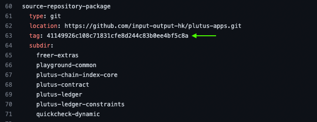

# Installing plutus playground using Docker container
## Overview
This guide will show you how to compile and install plutus playground using Docker.

## 1. Copy one of the `GIT_TAG`

| **Week** | **GIT_TAG**                          |
|-----------|------------------------------------------|
| Week01    | 41149926c108c71831cfe8d244c83b0ee4bf5c8a |
| Week02    | 6aff97d596ac9d59460aab5c65627b1c8c0a1528 |
| Week03    | 4edc082309c882736e9dec0132a3c936fe63b4ea |
| Week04    | ea1bfc6a49ee731c67ada3bfb326ee798001701a |
| Week05    | 62efdd2bfab3e076d40e07f8f4d7864a7f2ccc91 |
| Week06    | 6e3f6a59d64f6d4cd9d38bf263972adaf4f7b244 |
| Week07    | 13836ecf59649ca522471417b07fb095556eb981 |
| Week08    | c9c1e917edbfa3b972c92108d7b94d5430e07a28 |
| Week09    | 400318e0976b82e0ba7692edf26d93293589c671 |
| Week10    | 14bed17e8608162ee81969e482c1815fb78bd7b0 |

>Note: commits are taken from cabal project file of each week

>Please refer to the following link as an example:

https://github.com/input-output-hk/plutus-pioneer-program/blob/main/code/week01/cabal.project



## 2. Building plutus playground image
```
DOCKER_BUILDKIT=1 docker compose build --build-arg GIT_TAG=<GIT_TAG> 
```
>Where <GIT_TAG> is, for example week01 &rarr; `41149926c108c71831cfe8d244c83b0ee4bf5c8a`

>:hourglass_flowing_sand: Building time is around 20 mins 

## 3. Running container

```
docker compose up -d
```
>:hourglass_flowing_sand: Getting plutus playground up and running is around 10 mins

## 4. Plutus Playground website
```
https://localhost:8009/
```
